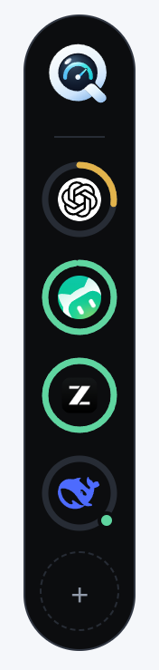
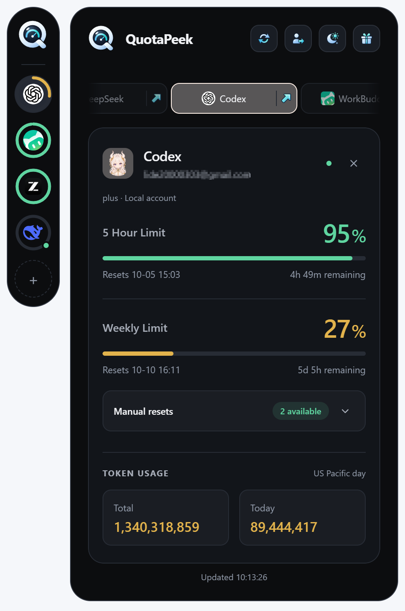
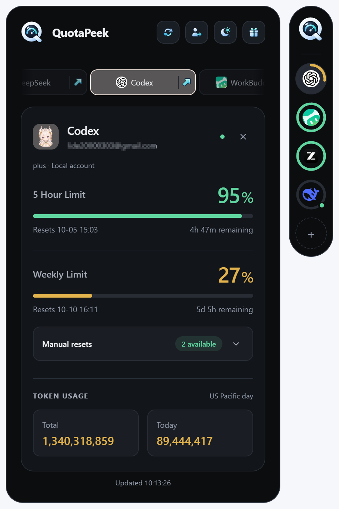
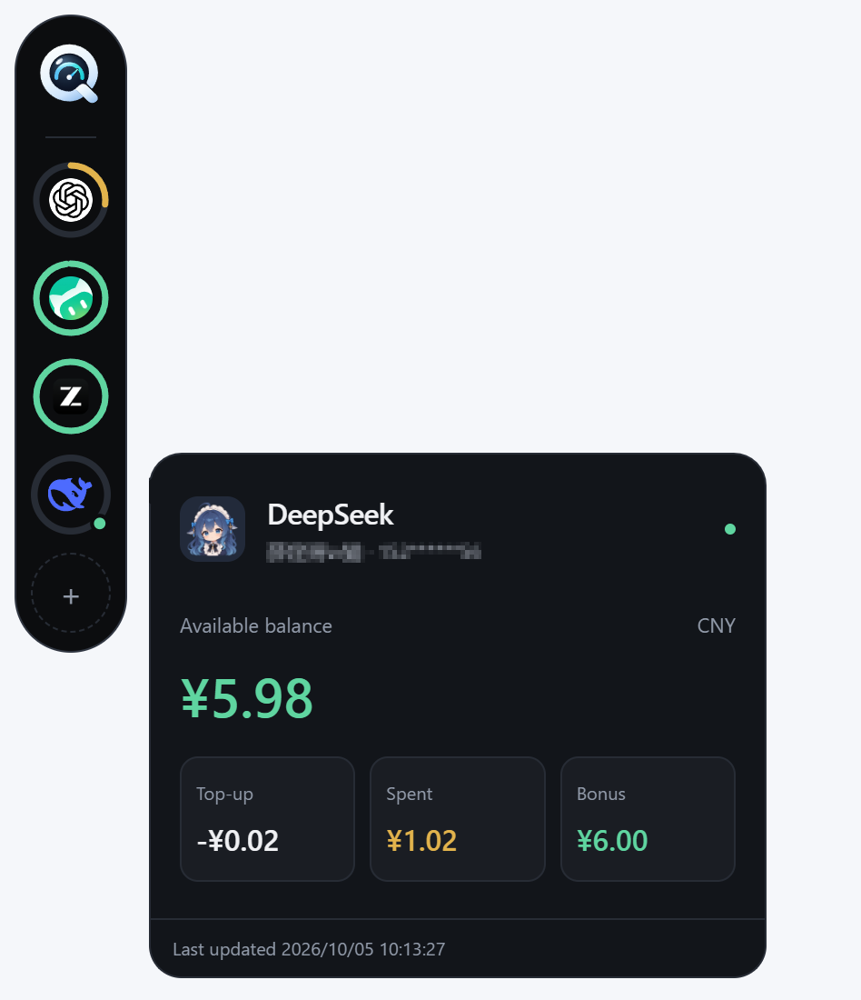
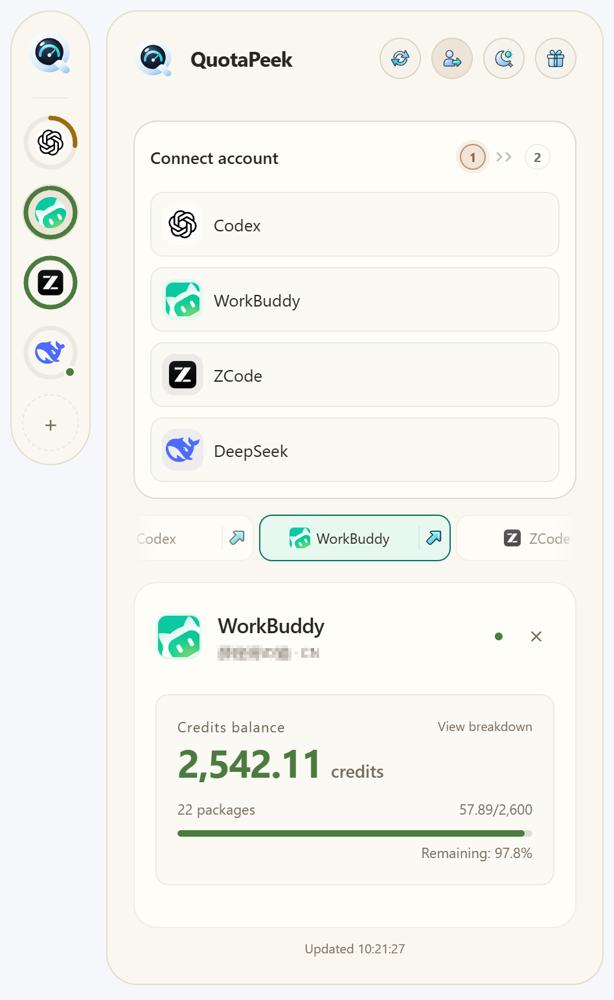
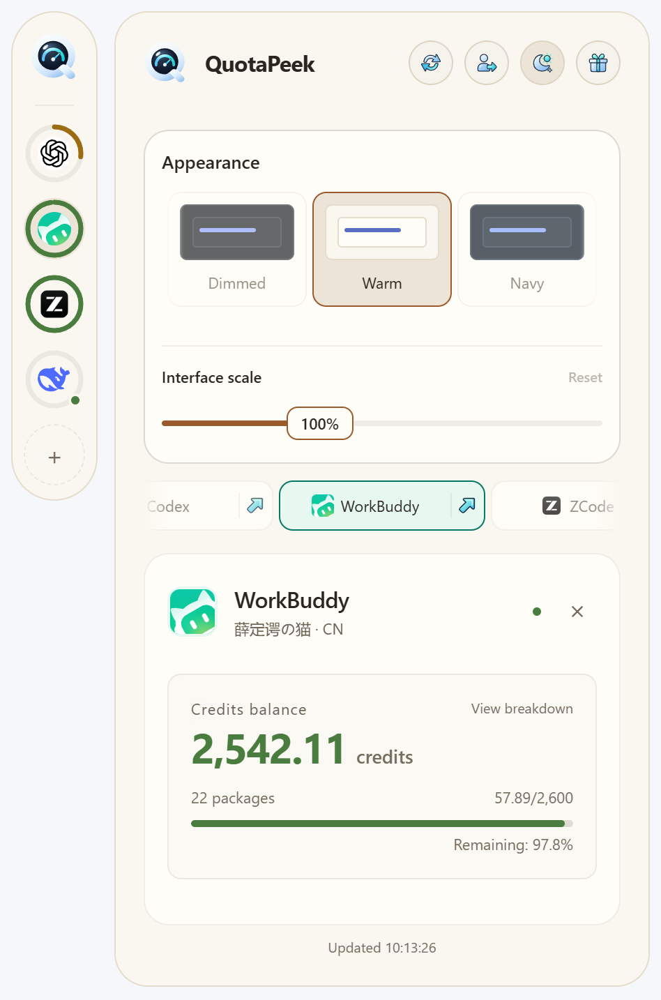
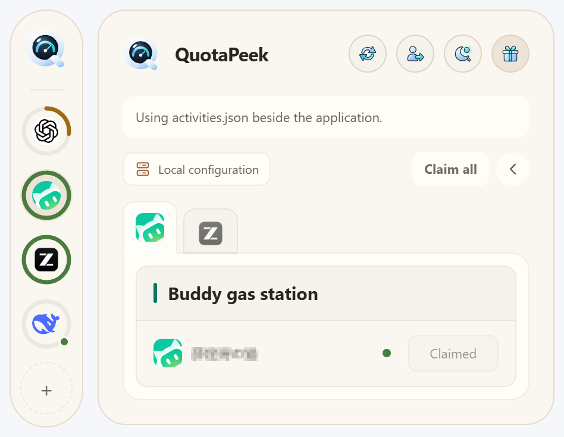

<p align="center">
  
</p>

<h1 align="center">QuotaPeek</h1>

<h3 align="center">一眼掌握 AI 服务额度。</h3>

<p align="center">
  在桌面悬浮侧栏查看 AI 服务的额度、余额和重置时间。<br />
  Codex · WorkBuddy · ZCode · DeepSeek
</p>

<p align="center">
  <a href="https://github.com/LiDe2000/QuotaPeek/releases">下载</a> ·
  <a href="#界面预览">界面预览</a> ·
  <a href="#下载安装与使用">快速使用</a> ·
  <a href="#从源码开发">开发指南</a> ·
  <a href="README.md">English</a>
</p>

<p align="center">
  
  
  
  
  
  <a href="LICENSE"></a>
</p>

基于 React、TypeScript 和 Tauri 2，主要面向 Windows；其他平台尚未完成实机验证。

## 功能

- 集中查看 Codex、WorkBuddy、ZCode 和 DeepSeek 的额度或余额。
- 按供应商切换多个账户，保存账户选择和平台顺序。
- 悬停预览缓存，单击刷新，支持刷新全部账户。
- 查询失败时保留上次结果，显示错误和最后成功时间。
- 点击供应商名称旁的箭头打开应用：Windows 优先启动已安装的桌面客户端（DeepSeek 对应 DeepSeek Harness），不可用时打开官方网页。Codex 后备为 ChatGPT，DeepSeek 为聊天页，WorkBuddy 为网页工作台，ZCode 为下载页。目标应用沿用自身登录状态，不自动切换账户；其他平台直接打开网页。
- 自适应卡片高度与左右展开方向，支持五种主题（Dark、Light、Dimmed、Warm、Navy）和托盘驻留。
- 在外观设置中调整整体界面缩放（75%–150%），同步缩放侧栏、卡片和原生窗口，自动保存；Reset 恢复 100%。

## 界面预览

<table align="center">
  <tr>
    <td align="center" width="225">
      <strong>侧栏</strong><br /><br />
      <br /><br />
    </td>
    <td align="center" width="225">
      <strong>向右展开</strong><br /><br />
      <br /><br />
    </td>
    <td align="center" width="225">
      <strong>向左展开</strong><br /><br />
      <br /><br />
    </td>
    <td align="center" width="225">
      <strong>悬停预览</strong><br /><br />
      <br /><br />
    </td>
  </tr>
</table>

<table align="center">
  <tr>
    <td align="center" width="300">
      <strong>登录</strong><br /><br />
      <br /><br />
    </td>
    <td align="center" width="300">
      <strong>外观设置</strong><br /><br />
      <br /><br />
    </td>
    <td align="center" width="300">
      <strong>活动领取</strong><br /><br />
      <br /><br />
    </td>
  </tr>
</table>

## 支持的服务

| 服务 | 查询内容 | 连接方式 |
| --- | --- | --- |
| Codex | 额度窗口、剩余比例、重置时间 | 本机 Codex 的 ChatGPT 登录状态，支持一个本地账户 |
| WorkBuddy | Credits、套餐明细、到期时间 | 浏览器授权，支持多个账户 |
| ZCode | 额度余额、使用比例、额度明细 | 浏览器授权，支持 Z.ai 和 BigModel 多个账户 |
| DeepSeek | 总余额、充值余额、赠金余额、累计消费 | 浏览器登录，支持多个账户；已有 API Key 账户仍可刷新 |

未返回的数据显示为未知，不推算额度或累计消费。Codex 的 API Key 登录不支持订阅额度查询。

## 下载安装与使用

### 下载与运行

从 [GitHub Releases](https://github.com/LiDe2000/QuotaPeek/releases) 的 **Assets** 下载对应架构的附件；若尚无附件，可从源码构建。

| 版本 | 使用方式 |
| --- | --- |
| 便携版 `quotapeek.exe` | 放在可写目录，双击运行；升级时替换 exe，保留同级 `data/` |
| 安装包 `*-setup.exe` 或 `.msi` | 运行安装程序，从开始菜单或快捷方式启动 |

运行发布版无需 Node.js、Rust/Cargo 或编译工具。Windows 需要 [WebView2 Runtime](https://developer.microsoft.com/en-us/microsoft-edge/webview2/#download-section)。

### 连接账户

1. 点击侧栏的 **＋**，选择服务。
2. 按提示完成浏览器授权或登录；Codex 需提前在本机安装并登录。
3. 连接成功后查看结果。再次启动会恢复账户并查询额度。

DeepSeek 默认使用开放平台账户登录，无需 API Key。隐藏连接面板不会取消登录，取消需使用面板中的取消操作。

### 日常操作

| 操作 | 功能 |
| --- | --- |
| 悬停 / 单击供应商图标 | 预览缓存 / 刷新当前账户 |
| 单击 QuotaPeek 主图标 | 打开或收起主面板 |
| 账户标签 / 预览中的数字按钮 | 切换同一供应商的账户 |
| 卡片右上角 **×** | 确认后移除本地连接、授权信息和缓存 |
| 主面板刷新按钮 | 刷新全部账户 |
| 长按平台图标或标签约半秒后拖动 | 调整平台顺序，两处同步并保存；Esc 取消 |
| 聚焦平台图标或标签后按 Alt + 方向键 | 调整平台顺序 |
| 主题设置 | 切换 Dark、Light、Dimmed、Warm、Navy |
| 左键 / 右键点击托盘 | 显示面板 / 打开显示、隐藏、置顶和退出菜单 |

关闭窗口只隐藏到托盘，完全退出使用托盘菜单 **Quit**。移除账户不会退出供应商网站或本机 Codex；重新连接可恢复使用。

### 数据与升级

| 版本 | 数据目录 |
| --- | --- |
| 便携版 | exe 同级 `data/` |
| 安装版 | `%LOCALAPPDATA%/com.lide.quotapeek/` |

目录中包含 `quotapeek.db` 和 `webview/`。备份或移动前完全退出应用，复制整个数据目录。Windows 凭据使用当前用户范围 DPAPI 加密，跨电脑或用户通常需重新授权；Codex 登录由本机 Codex 管理。详见 [数据存储](docs/storage.md)。

## 从源码开发

### 环境要求

- Node.js 22.12 或更高版本、npm、Git。
- [Rust/rustup](https://rust-lang.org/tools/install/)，包含 `rustc` 和 `cargo`；Windows 使用 stable MSVC 工具链。
- [Microsoft C++ Build Tools](https://visualstudio.microsoft.com/visual-cpp-build-tools/)，勾选 **使用 C++ 的桌面开发**，安装 MSVC 和 Windows SDK。
- WebView2 Runtime。完整平台要求见 [Tauri 前置依赖](https://v2.tauri.app/start/prerequisites/)。

Windows 可通过 PowerShell 安装 Rust：

```powershell
winget install --id Rustlang.Rustup
```

安装后重开终端或 IDE，确认以下命令可用：

```powershell
node --version
npm --version
rustc --version
cargo --version
```

`npm ci` 只安装 JavaScript 依赖，不安装 Rust/Cargo 或系统编译工具。

### 获取源码与启动

```sh
git clone https://github.com/LiDe2000/QuotaPeek.git
cd QuotaPeek
npm ci
npm run tauri dev
```

首次运行会下载并编译 Rust 依赖。`npm run dev` 仅启动浏览器界面，原生查询需完整桌面应用。修改 Rust、Tauri 配置或权限后重启桌面开发进程。

### 检查与构建

```sh
npm run check
npm test
npm run build
cargo test --manifest-path src-tauri/Cargo.toml
```

`check` 检查 TypeScript 和全部 Rust 目标、特性的 Clippy 警告；`build` 只构建前端。真实服务集成测试默认跳过，执行方式见 [开发文档](docs/development.md#测试与检查)。

| 命令 | 产物 |
| --- | --- |
| `npm run tauri:build:portable` | `src-tauri/target/release/quotapeek.exe`，便携数据策略 |
| `npm run tauri:build:installed` | `src-tauri/target/release/bundle/` 下的 NSIS、MSI，安装版数据策略 |

两种构建会覆盖同一个 release exe，发布时分别收集对应产物。安装包生成还可能下载打包工具；排查见 [常见问题](docs/troubleshooting.md)。

### 一键构建发布包

要一次构建全部三种 Windows x64 发布产物，可双击项目根目录的 `build-release.cmd`，或运行：

```powershell
.\build-release.ps1
```

脚本读取项目版本，将便携 ZIP、NSIS `.exe` 安装包和 MSI 安装包收集到 `release/<version>/`。它会先归档便携版 exe，再构建安装版，并排除本地账户数据。同一版本的已有产物会被覆盖。运行前需满足上述 Windows 开发环境要求；缺少 JavaScript 依赖时，脚本会运行 `npm ci`。首次构建时，Tauri 可能下载安装包打包工具。

使用 `.\build-release.ps1 -DryRun` 可预览构建命令而不实际构建；使用 `-OutputDirectory <path>` 可指定其他输出目录。

## 文档

详细指南目前以中文提供。

| 文档 | 内容 |
| --- | --- |
| [开发文档](docs/development.md) | 目录职责、状态流程、窗口实现、测试和扩展 |
| [整体界面缩放设计](docs/interface-scale.md) | 滑块交互、缩放过渡与原生窗口稳定性 |
| [活动配置](docs/activity-service.md) | 服务端配置优先、本地回退、设备端执行和模拟测试 |
| [数据存储](docs/storage.md) | 数据位置、凭据保护、数据库升级和便携验证 |
| [常见问题](docs/troubleshooting.md) | 运行、编辑器、构建和渲染问题 |

## 反馈与贡献

通过 [Issues](https://github.com/LiDe2000/QuotaPeek/issues) 报告问题，或提交 Pull Request。请提供系统与应用版本、复现步骤和错误信息，公开前移除凭据、授权链接和日志中的敏感信息。

## 许可证

[MIT License](LICENSE)
